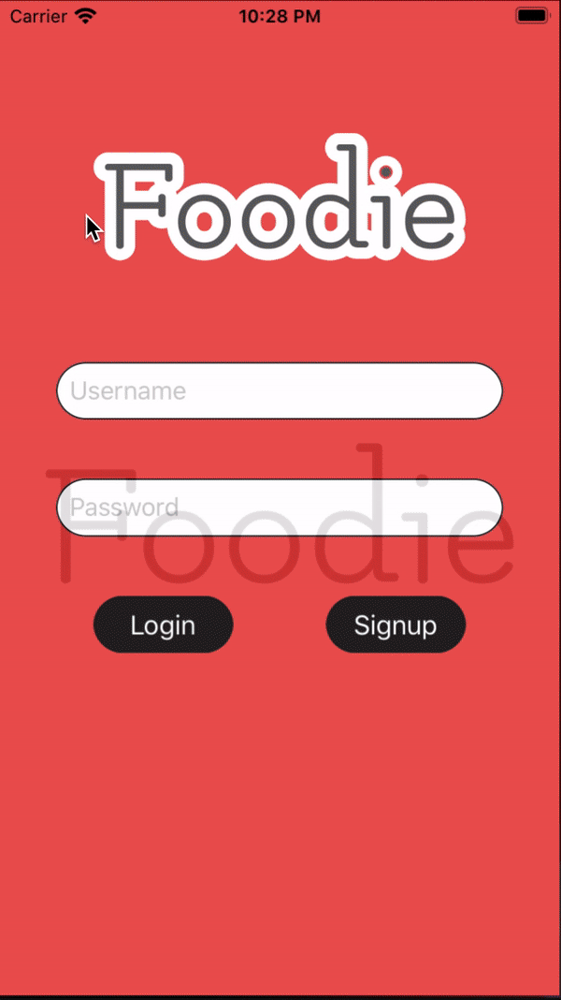

# FOODIE <3



## Table of Contents
1. [Overview](#Overview)
1. [Product Spec](#Product-Spec)
1. [Wireframes](#Wireframes)
2. [Schema](#Schema)

## Overview
### Description
Want a decent meal with your friends, but don't know where to meet up? Well look no further, because going on food dates has never been easier with **FOODIE**, the ultimate food dating app! Just input your taste preferences and you will be put in contact with friends who have similar tastes as well as restaurants that sell those food items!

### App Evaluation

- **Category:** Food & Drink, Social Networking
- **Mobile:** This app will be developed for iPhone. 
- **Story:** As a user I want to be able to find other people with similar food tastes so that I can schedule food dates and hang-outs with them at our favorite restaurants.
- **Market:** Students, couples, foodies, anyone who wants to bond with another human being over food.
- **Habit:** How often the app will be used is depending on how often users want to network with friends over food topics.
- **Scope:** First, we would start with making a meetup app for a niche audience who want to bond over food, then this idea may develop into a broader social media platform for users who would like to partake in food-related networking.

## Product Spec

### 1. User Stories (Required and Optional)

**Required Must-have Stories**

* Users want to be able to create an account to access all the app's features
* Users want to be able to login to the app to see its features
* Users want to contact other users
* Users want to be recommended friends who share similar food tastes
* Users want to post videos or photos of their food-related hangouts
* Users want to be recommended restaurants based on location and food preferences
* Users want to view details about a restaurant in order to learn about their menu and quality
* Users want to create a profile that displays their personality
* Users want to view videos/photos of their friend's hangouts
* Users want to be able to submit their food preferences

**Optional Nice-to-have Stories**

* Users want to be able to make reservations and order food online
* Users want to use an integrated payment system like Venmo

### 2. Screen Archetypes

* Login Screen
    * Users want to be able to login to the app to see its features
* Signup Screen
    * Users want to be able to create an account to access all the app's features
* Restaurant List Screen
    * Users want to be recommended restaurants based on location and food preferences
* User Profile Screen
    * Users want to create a profile that displays their personality
* Restaurant Details Screen
    * Users want to view details about a restaurant in order to learn about their menu and quality
    * Users want to be able to make reservations and order food online
* Story Screen
    * Users want to post videos or photos of their food-related hangouts
    * Users want to view videos/photos of their friend's hangouts
* Friends Screen
    * Users want to contact other users
    * Users want to be recommended friends who share similar food tastes
* Food Preferences Screen
    * Users want to be able to submit their food preferences

### 3. Navigation

**Tab Navigation** (Tab to Screen)

* Story Screen (Home)
* Friends Screen (Friends)
* Restaurant List Screen (Foods)
* Profile Screen (Me)

**Flow Navigation** (Screen to Screen)

* Login Screen
    * Signup Screen
    * Story Screen
* Signup Screen
    * Login Screen
    * Food Preferences Screen
* Food Preferences Screen
    * Story Screen
* Story Screen
    * Restaurant List Screen
    * Friends Screen
    * Profile Screen
* Friends Screen
    * Profile Screen
    * Restaurant List Screen
    * Story Screen
* Restaurant List Screen
    * Restaurant Details Screen
    * Friends Screen
    * Profile Screen
    * Story Screen
* Profile Screen
    * Restaurant List Screen
    * Friends Screen
    * Story Screen
## Wireframes


### [BONUS] Digital Wireframes & Mockups


### [BONUS] Interactive Prototype

N/A

## Schema 

```javascript
{
   User: [
      {ID, Username: String, Password: String, Name: String, Email: String, Social Media: [String], Friends: [User.id], Preferences: [Cuisine.id], Location: JSON, Stories: [Story.id], LastActiveTime: Date, ChatRooms: [ChatRoom.id]}
   ]

   Restaurant: [
      {ID, Location: JSON, Style: Cuisine.id, Menu: JSON, Pictures: [Picture.id], Hours: String, Email: String, Phone: String}
   ]

   Cuisine: [
      {ID, Name: String}
   ]

   Picture: [
      {ID, Uri: String, Picture: Base64}
   ]

   Story: [
      {ID, Creator: User.id, Participants: [User.id], Location: JSON, Title: String, Description: String, Pictures: [Picture.id], Likes: [User.id], Comments: [Comment.id]}
   ]

   Comment: [
      {ID, User: User.id, Text: String}
   ]

   ChatRoom: [
      {ID, Users: [User.id], Topic: String, Messages: [Message.id]} 
   ]

   Message: [
      {ID, Sender: [User.id], Text: String}
   ]
}
```

### Models
| Model    | Structure    |
|----------|--------------|
| User     | ID, Username: String, Password: String, Name: String, Email: String, Social Media: [String], Friends: [User.id], Preferences: [Cuisine.id], Location: JSON, Stories: [Story.id], LastActiveTime: Date, ChatRooms: [ChatRoom.id] |
| Restaurant | ID, Location: JSON, Style: Cuisine.id, Menu: JSON, Pictures: [Picture.id], Hours: String, Email: String, Phone: String|
| Cuisine | ID, Name: String |
| Picture | ID, Uri: String, Base64 Picture |
| Story | ID, Creator: User.id, Participants: [User.id], Location: JSON, Title: String, Description: String, Pictures: [Picture.id], Likes: [User.id], Comments: [Comment.id] |
| Comment | ID, User: User.id, Text: String |
| ChatRoom | ID, Users: [User.id], Topic: String, Messages: [Message.id] |
| Message | ID, Sender: [User.id], Text: String |

### Networking
- List of network requests by screen
    - Story Screen
        - /top-friend-stories
        - /start-recording
        - /save-recording
    - Friends Screen
        - /get-friends
        - /get-recommended-friends
    - Restaurant List Screen
        - /get-all-best-restaurants
    - Profile Screen
        - /get-current-user-profile
        - /change-user-info
    - Login Screen
        - /login
    - Signup Screen
        - /signup
    - Restaurant Details Screen
        - /get-restaurant-details
    - Food Preferences Screen
        - /submit-food-preferences

- Basic snippets for each Parse network request

```swift
    
   @IBAction func onSignIn(_ sender: Any) {
      let username = usernameField.text!
      let password = passwordField.text!
      PFUser.logInWithUsername(inBackground: username, password: password){
         (user, error) in
            if(user != nil) {
               self.performSegue(withIdentifier: "loginSegue", sender: nil)
            } else{
               print("Error: \(error?.localizedDescription)")
            }
        }
   }

    @IBAction func onSignIn(_ sender: Any) {
      let user = PFUser()
      let username = usernameField.text!
      let password = passwordField.text!
      user.signUpInBackground { (success, error) in
         if success{
            self.performSegue(withIdentifier: "loginSegue", sender: nil)} else{
               print("Error: \(error?.localizedDescription)")
            }
         }
    }
```
    ...more to be implemented.

- Endpoints for Existing APIs:
    1. Yelp API for list of restaurants
        - https://api.yelp.com/v3/businesses/search
    3. Firebase Auth
        - /login
        - /signup 
